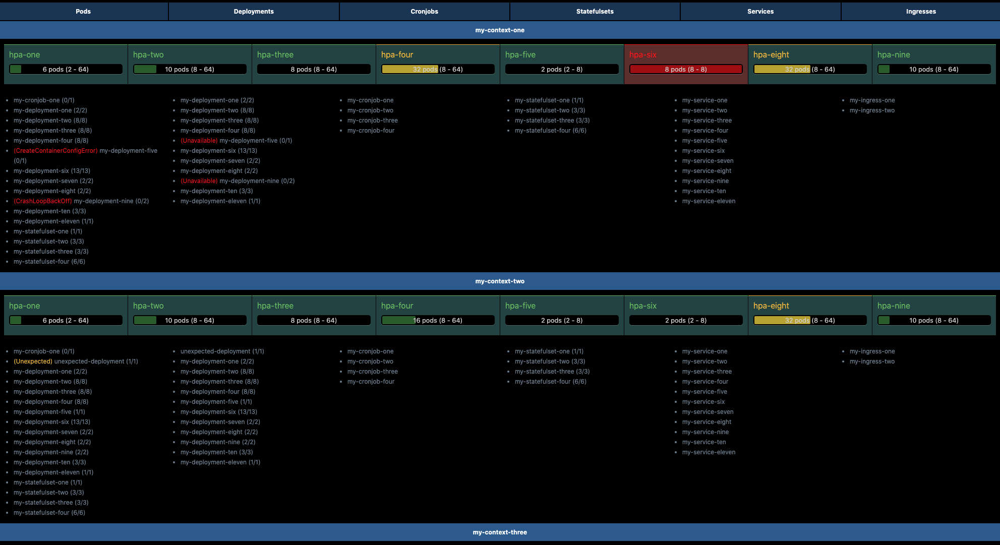
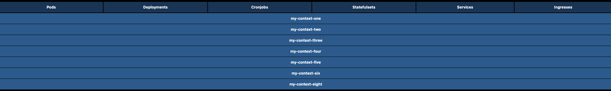
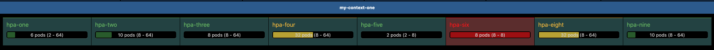
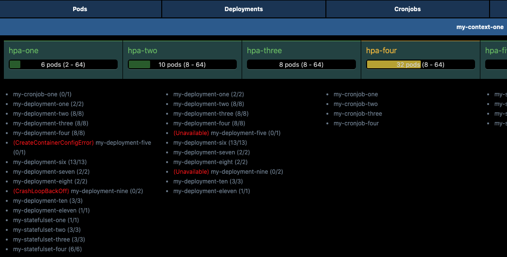
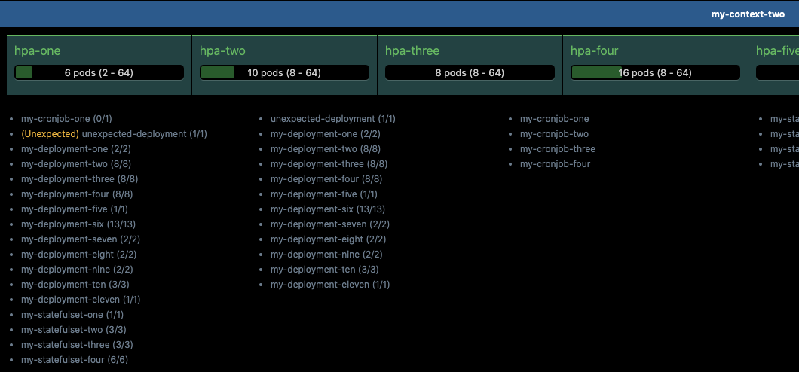

# K8S HTML Reporter

## Description

This project creates a **HTML site** where you can find a **global summary of all your kubernetes resources in all your clusters** at the same time.
Goal of this project is avoid to navigate through differents k8s contexts and get all the info at once using **kubectl commands** to get current clusters status.

<p align="center">
  
  
</p>

<p align="center">
  
</p>

## Usage

### Prerequisites
- kubectl
- Access to your clusters via kubectl (kubeconfig correctly set)

### Configuration

In order to use this project, you have to configure resources in config.json file.

First step is setting the environments (contexts) you can to overview (You can specify, or not, namespace to be used in each one):
```json
"environments": [
    {
        "context": "my-context-one",
        "namespace": "my-specific-namespace"
    },
    "my-context-two"
]
```


Second step is selecting k8s resources to be got:
```json
"resources": [
    "pod",
    "deployment",
    "cronjob",
    "statefulset",
    "service",
    "hpa",
    "ingress"
]
```

Final step is selecting html file where your report will be created:
```json
 "reportName": "report.html"
```

Optionally you can add a list of "expected" resources (deployments, cronjobs and stateful set you expect to be there):
```json
"expectedResources": [
    "my-expected-statefulset",
    "my-expected-deployment",
    "my-expected-cronjob"
],
```

### Launch
In order to create the report, simply execute `node index.js` and it will start getting resources information and finally it will open a browser website with the summary.

## Features

#### Multi context information
In the same HTML page all contexts will be available, so not needed to navigate through different tabs or wait to retrieve information. So everything is easy to be checked at once.
<p>
  
</p>

#### HPA status
For every context, HPA status for all pods can be quickly reviewed. Depending on the current replicas and min/max configuration, different warnings can appear.
<p>
  
</p>

#### Errors discovery
If any pod or deployment is issued, a warning in red color will appear. This allows to check quickly any error in all clusters at once.
<p>
  
</p>

#### Unexpected resources discovery
If `expectedResources` set in config.json, any resource that is not listed there will be shown with a warning, so you will be able to see unexpected resources in your contexts.
<p>
  
</p>

## How to contribute
Learn how to start contribution on the [Contributing Guidline](CONTRIBUTING.md).

## License
[Apache License 2.0](LICENSE)